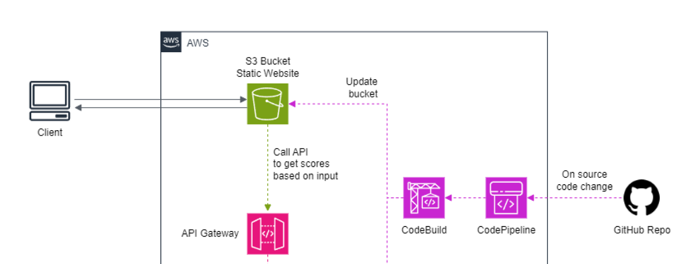

# Student Space's frontend client

## Introduction
This is the frontend client for the Student Space application.

## Requirements
- User can generate a score report by searching for their potential rental address and their school address.
- User config the report to toggle different criteria and search radius.
- User can move around the map to see amenities around their rental location.
- User can bookmark the listing for comparison.

## High Level design

### Web Client
A NextJS application to let user request score report. The web app will be hosted on Vercel as it has first-class support for NextJS.

### S3 Bucket

### CodePipeline / CodeBuild

### API Gateway

## Detailed design
